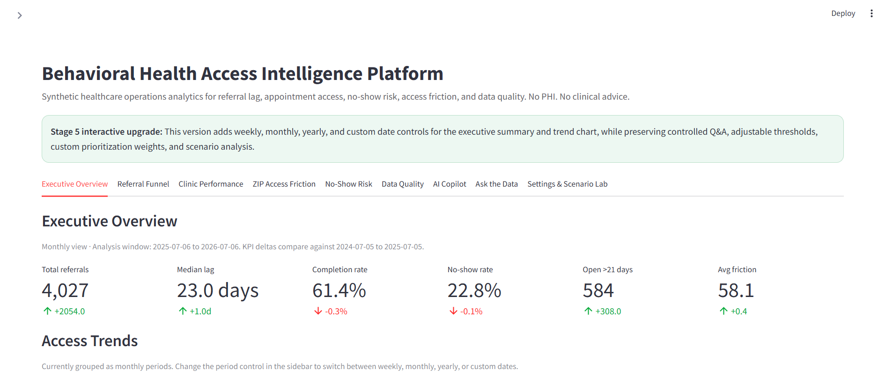
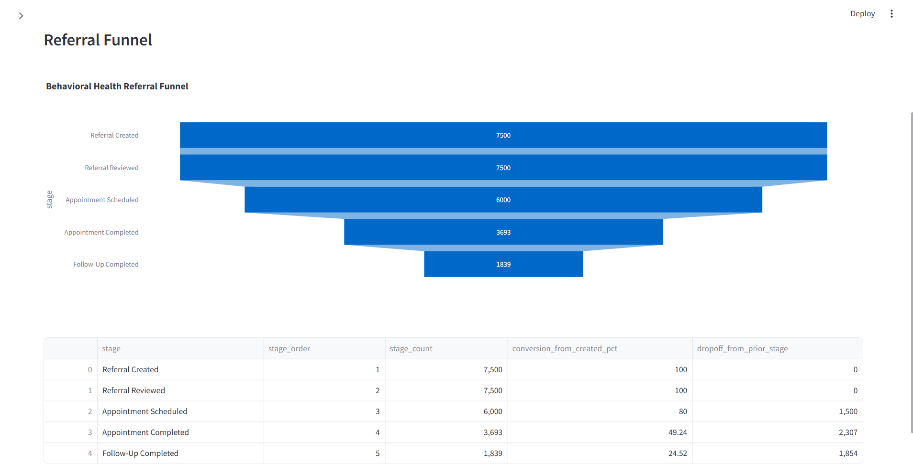
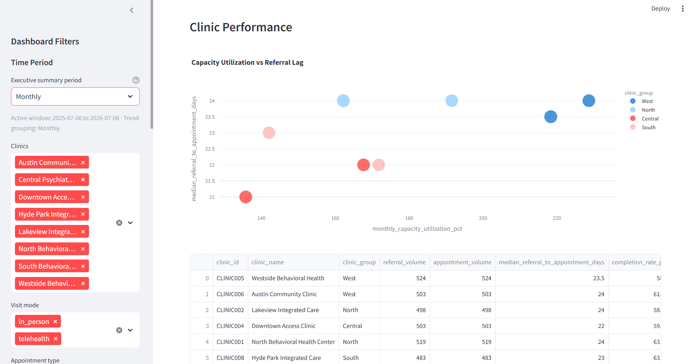
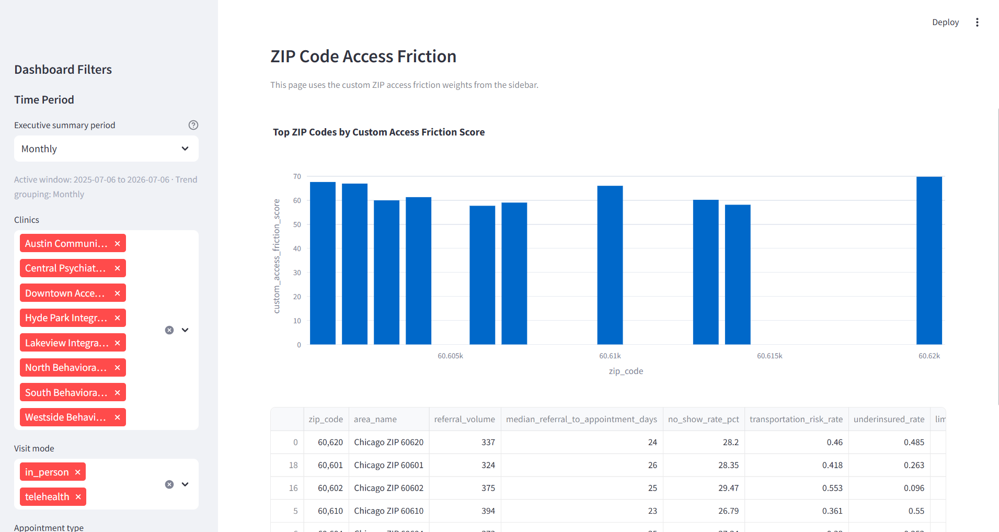
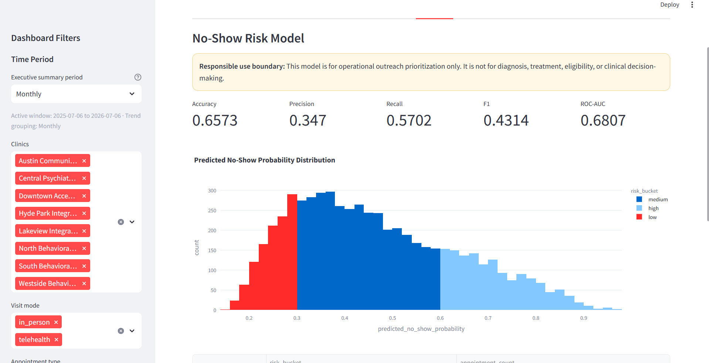
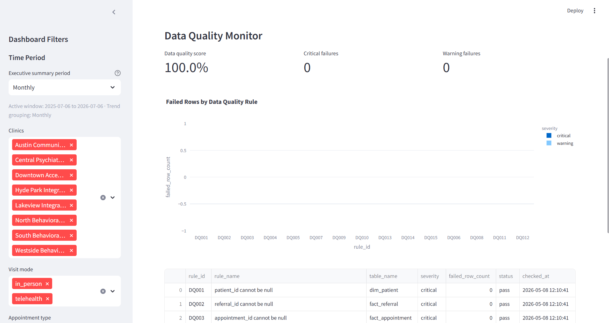
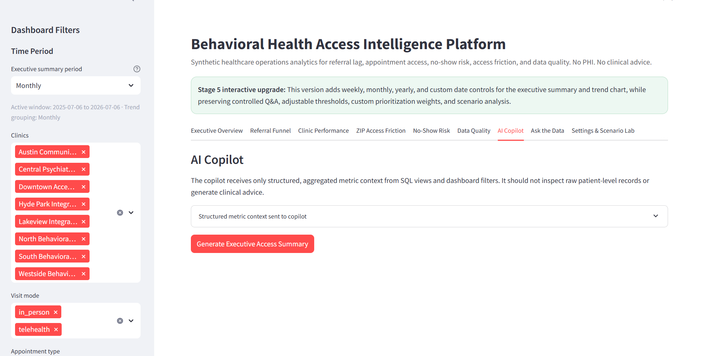
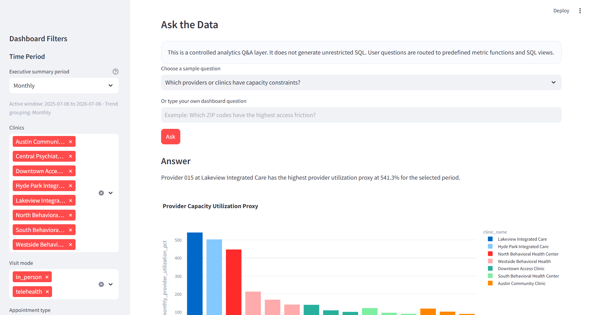
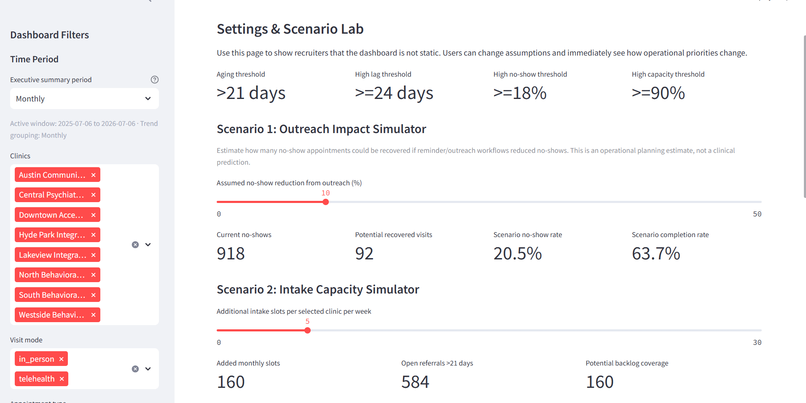

# Behavioral Health Access Intelligence Platform

An AI-assisted healthcare operations analytics project for tracking behavioral health referral lag, appointment access, no-show risk, ZIP-code access friction, clinic performance, and data quality using synthetic EHR-style data.

> **No PHI. No real patient data. No clinical advice. Synthetic data only.**

---

## Overview

This project simulates a healthcare operations analytics platform for behavioral health access management.

It helps answer questions such as:

- Which clinics have the longest referral-to-appointment delays?
- How many referrals are still open after the aging threshold?
- Where are patients dropping off in the referral funnel?
- Which ZIP codes have higher access friction?
- Which appointment types have higher no-show rates?
- Which clinics may need operational attention?
- What should leadership prioritize this week?

The project combines SQL analytics, Python ETL, Streamlit dashboards, a no-show prediction model, data quality checks, and a responsible AI copilot.

---

## Key Features

- **Executive Overview**  
  High-level KPIs for referrals, lag, completion rate, no-show rate, access friction, and open referrals.

- **Referral Funnel**  
  Tracks the journey from referral creation to review, scheduling, appointment completion, and follow-up.

- **Clinic Performance**  
  Compares clinics by lag, no-show rate, completion rate, open referrals, and capacity indicators.

- **ZIP Access Friction**  
  Ranks ZIP codes using referral lag, no-show rate, transportation risk, insurance proxy, language proxy, and telehealth usage.

- **No-Show Risk Model**  
  Uses machine learning to estimate no-show probability for operational outreach prioritization.

- **Data Quality Monitor**  
  Checks missing IDs, invalid statuses, impossible dates, orphan records, and other data quality issues.

- **AI Copilot**  
  Summarizes structured operational metrics into executive summaries and recommended operational actions.

- **Ask the Data**  
  Lets users ask controlled analytics questions without allowing unrestricted SQL generation.

- **Interactive Settings**  
  Users can change thresholds, weights, reporting periods, and scenario assumptions.

---

## Tech Stack

- Python
- Pandas
- NumPy
- DuckDB
- SQL
- Streamlit
- Plotly
- scikit-learn
- joblib
- OpenAI API optional

---

## Project Structure

```text
behavioral-health-access-intelligence/
│
├── app/
│   └── streamlit_app.py
│
├── data/
│   ├── synthetic/
│   └── warehouse/
│
├── docs/
│
├── models/
│
├── sql/
│   ├── 01_create_schema.sql
│   ├── 02_create_views.sql
│   └── 03_metric_queries.sql
│
├── src/
│   ├── config.py
│   ├── generate_synthetic_data.py
│   ├── load_warehouse.py
│   ├── data_quality.py
│   ├── no_show_model.py
│   └── copilot.py
│
├── artifacts/
│   └── screenshots/
│
├── README.md
├── requirements.txt
├── .env.example
├── .gitignore
└── LICENSE
```

---

## How to Run Locally

### 1. Clone the repository

```powershell
git clone https://github.com/YOUR_USERNAME/behavioral-health-access-intelligence.git
cd behavioral-health-access-intelligence
```

### 2. Create a virtual environment

```powershell
py -3.12 -m venv .venv
.\.venv\Scripts\Activate.ps1
```

If PowerShell blocks activation:

```powershell
Set-ExecutionPolicy -Scope Process -ExecutionPolicy Bypass
.\.venv\Scripts\Activate.ps1
```

### 3. Install dependencies

```powershell
pip install -r requirements.txt
```

### 4. Generate synthetic data

```powershell
python src/generate_synthetic_data.py
```

### 5. Load the analytics warehouse

```powershell
python src/load_warehouse.py
```

### 6. Train the no-show model

```powershell
python src/no_show_model.py
```

### 7. Start the Streamlit app

```powershell
streamlit run app/streamlit_app.py
```

---

## Optional AI Copilot Setup

Create a `.env` file in the project root:

```env
OPENAI_API_KEY=your_api_key_here
```

The dashboard can still run without an OpenAI API key. The AI copilot is optional.

---

## Project Screenshots

Add your screenshots to `artifacts/screenshots/` using the filenames below.

### Executive Overview



### Referral Funnel



### Clinic Performance



### ZIP Access Friction



### No-Show Risk



### Data Quality Monitor



### AI Copilot



### Ask the Data



### Settings & Scenario Lab



---


---

## Responsible AI Note

This project is not a clinical decision-support system.

The AI copilot does not diagnose, treat, recommend medication, determine eligibility, or make clinical decisions. It only summarizes structured operational metrics from predefined SQL views.

The no-show model is for operational outreach prioritization only.

---

## Author

**Joel Nithish Kumar Murugan**

AI Product & Operations Strategist focused on healthcare analytics, responsible AI, workflow optimization, and data-driven operational decision-making.
